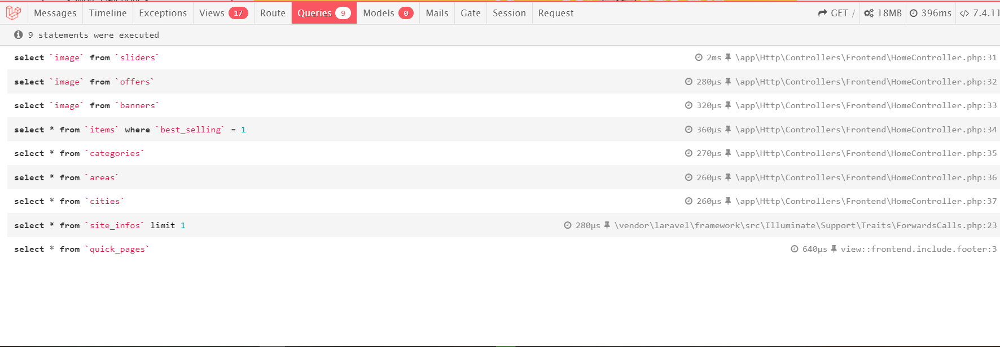
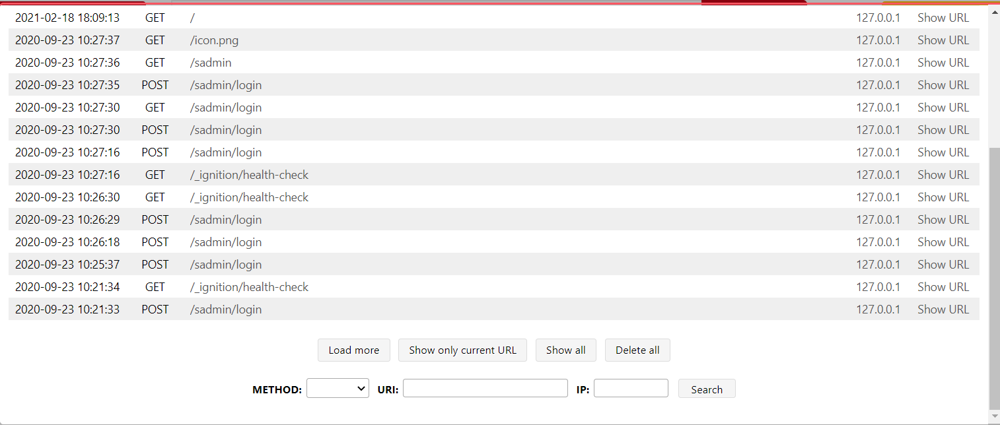

<a href="https://ahsanjuly29.github.io/LaravelEasySolutions/Adding%20Custom%20Debugger%20For%20more%20Information%20Laravel/">
	https://ahsanjuly29.github.io/LaravelEasySolutions/Adding-Custom-Debugger-For-more-Information-Laravel/
</a>

	<h2>How To Add Debugger In Laravel ? How To See Queries Count In Laravel ?</h2>
	
Simply using This package We can find A Beautiful debugger 

	<blockquote>
		"<b>composer require barryvdh/laravel-debugbar --dev</b>"
	</blockquote>
	
	

	

