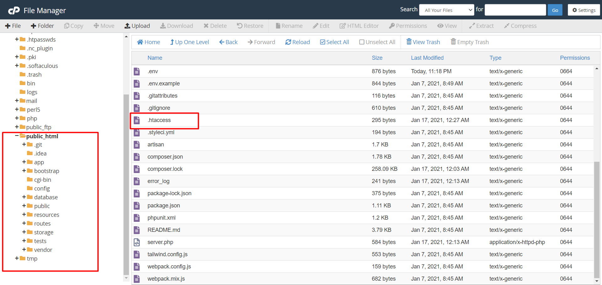

<h2 color="red">How To remove '/public' from 'Url' On Live Server ? Or on Live server run on base path but index .php in Public.</h2>
<h5 style="color:yellow;">#laravel(6 - upper version(old versions not sure! ))...</h5>

<ul>
   	<li>Go to 'public_html' or 'Base path' folder.</li>
	<li>'unzip' your 'Laravel' project manually Or if you using Git then directly you can copy your code by command:'git clone'. If you already connected with git then you can just use Command 'git pull' to be up to date with your github Updates</li>
	<li>After That, Create a file named '.htaccess' and write below codes:</li>
</ul>
<blockquote>
 RewriteEngine On  
 RewriteCond %{REQUEST_FILENAME} -d [OR]  
 RewriteCond %{REQUEST_FILENAME} -f  
 RewriteRule ^ ^$1 [N]  
 RewriteCond %{REQUEST_URI} (\.\w+$) [NC]  
 RewriteRule ^(.*)$ public/$1   
 RewriteCond %{REQUEST_FILENAME} !-d  
 RewriteCond %{REQUEST_FILENAME} !-f  
 RewriteRule ^ server.php  
</blockquote>

you can just copy &paste that.<strong>
Yeah!
Problem Solved. Now your Project is running on your domain.extention</strong>

<h2> #HappyCoding </h2>

