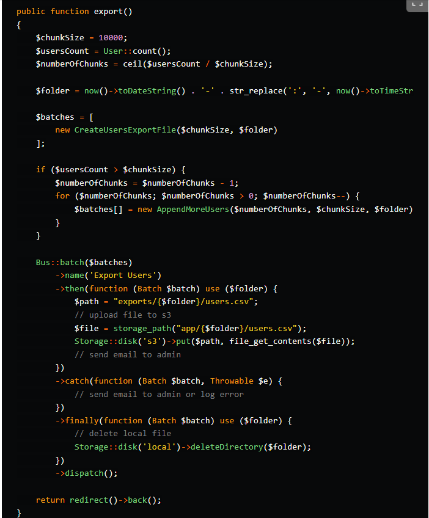

<title>How to export Million records using Laravel</title>

	<h2>How to export Million records using Laravel ?</h2>
	<h2>How to Use Bus Batch Laravel ??</h2>
	  
	

		<u><b>Solution:</b></u>
		
Type 1 <u>(Using FastExcel)</u>:

		
Type 2 <u>(Using Laravel Excel)</u>:

		

			Steps to follow how to export Million(s) records with Laravel using queue job Batch.
		

	

	
Before anything migrate batches table by using this Command:

	<blockquote>
		<ol style="padding-left: 2%;">
			<li>
				php artisan queue:batches-table
			</li>
			<li>
				php artisan migrate
			</li>
		</ol>
	</blockquote>
	
  
		<pre>Put</pre>
		<pre>QUEUE_CONNECTION=database</pre>
		<pre>to</pre>
		<pre> .Env</pre>
	

	
And Then Inside Controller:
		<b>Step 1:</b>
	

	<code>
		<pre>
			public function exportMethod()
			{
				$chunkSize = 10000;  <!-- // Example -->
				$totalCount = ModelName::count();
				$numberOfChunks = ceil($totalCount / $chunkSize);

				<!-- // making folder name  -->
				$folder = now()->toDateString() . '-' . str_replace(':', '-', now()->toTimeString());

				$batches = [
					<!-- this "CreateUsersExportFile" is the Export file Working as Trait for Bus batch -->
					new CreateUsersExportFile($chunkSize, $folder)
				];

				if ($totalCount > $chunkSize)
				{
					$numberOfChunks = $numberOfChunks - 1;
					for ($numberOfChunks; $numberOfChunks > 0; $numberOfChunks--)
					{
						$batches[] = new AppendMoreUsers($numberOfChunks, $chunkSize, $folder);
					}
				}

				Bus::batch($batches)
				->name('Export Users')
				->then(function (Batch $batch) use ($folder)
				{
					$path = "exports/{$folder}/users.csv";
					// upload file to s3
					$file = storage_path("app/{$folder}/users.csv");
					Storage::disk('s3')->put($path, file_get_contents($file));
					// send email to admin
				})
				->catch(function (Batch $batch, Throwable $e) {
					// send email to admin or log error
				})
				->finally(function (Batch $batch) use ($folder) {
					// delete local file
					Storage::disk('local')->deleteDirectory($folder);
				})->dispatch();

				return redirect()->back();
			}
		</pre>
	</code>
	
<b>Step 2(Using FastExcel):</b>

	
We need two main job files, create one called CreateUsersExportFile and the other called AppendMoreUsers

	
In CreateUsersExportFile:

	<code>
		<pre>
			class CreateUsersExportFile implements ShouldQueue
			{
				use Batchable, Dispatchable, InteractsWithQueue, Queueable, SerializesModels;
			
				public function __construct(
					public $chunkSize,
					public $folder
				) {
				}
			
				public function handle()
				{
					$users = User::query()
						->take($this->chunkSize)
						->get();
			
					Storage::disk('local')->makeDirectory($this->folder);
			
					(new \Rap2hpoutre\FastExcel\FastExcel($this->usersGenerator($users)))
						->export(storage_path("app/{$this->folder}/users.csv"), function ($user) {
							return [
								'id' => $user->id,
								'name' => $user->id,
								'email' => $user->id,
								// ....
							];
						});
				}
			}
			
			private function usersGenerator($users)
			{
			   foreach ($users as $user) {
				  yield $user;
			   }
			}			
		</pre>
	</code>

	
In AppendMoreUsers:

	<code>
		<pre>
			class AppendMoreUsers implements ShouldQueue
			{
				use Batchable, Dispatchable, InteractsWithQueue, Queueable, SerializesModels;
			
				public function __construct(
					public $chunkIndex,
					public $chunkSize,
					public $folder
				) {
				}
			
				public function handle()
				{
					$users = User::query()
						->skip($this->chunkIndex * $this->chunkSize)
						->take($this->chunkSize)
						->get()
						->map(function ($user) {
							return [
								$user->id,
								$user->name,
								$user->email,
							];
						});
			
					$file = storage_path("app/{$this->folder}/users.csv");
					$open = fopen($file, 'a+');
					foreach ($users as $user) {
						fputcsv($open, $user);
					}
					fclose($open);
				}
			}			
		</pre>
	</code>

	

		Now run 
		<blockquote>
			php artisan queue:work
		</blockquote> 
		and send your request.
	

	<!-- 
Ref Images: 

	 -->

	

		<b>
			Ref:
		</b>
		<a
			href="https://dev.to/rabeeaali/how-to-export-million-records-using-laravel-noc">https://dev.to/rabeeaali/how-to-export-million-records-using-laravel-noc</a>
	

