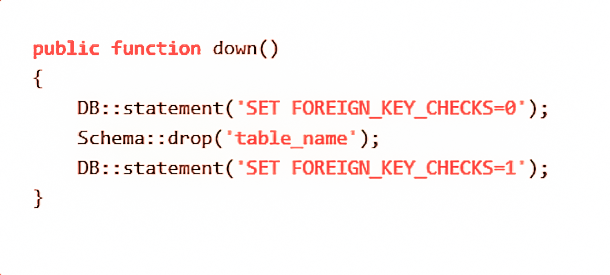

<h2>How To Solve The Foreign key Check Problem Simply ??</h2>
<h3>First: Disable Foreign Key Check While Migration </h3>

	Example-1: <blockquote>DB::statement('SET FOREIGN_KEY_CHECKS=0');</blockquote>

OR

	Example-2:
<blockquote>Schema::disableForeignKeyConstraints();</blockquote>

<h4>Write Your Database Opretions here like 'drop Table' After That </h4>
<h3>Last: Enable Foreign Key Check While Migration</h3>

	Example-1: 
<blockquote>DB::statement('SET FOREIGN_KEY_CHECKS=1');</blockquote>

	Example-2:
	<blockquote>Schema::disableForeignKeyConstraints();</blockquote>

