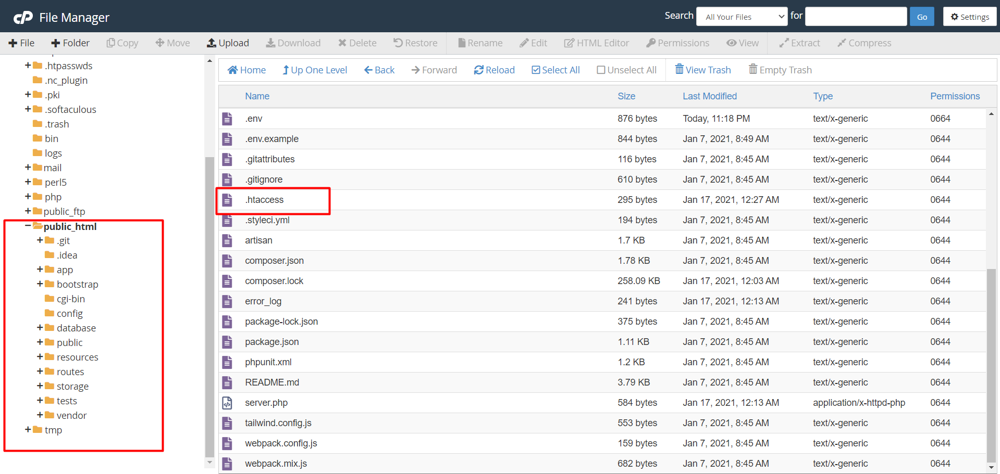

 <div style="margin: 0 auto; display: table; text-transform: capitalize;">

<h2 color="red">How to Remove '/public' from the URL on a Live Server or Run Laravel on a Base Path with index.php in Public Directory</h2>

<h5 style="color: yellow;">This guide is for Laravel 6.x and above (Older versions might require different setup)</h5>

## Steps to Remove '/public' from the URL on a Live Server

1. **Navigate to the 'public_html' or 'Base Path' Directory:**
    - This is the root directory of your website where all your web files reside. It’s the folder that the web server (e.g., Apache, Nginx) serves publicly.

2. **Upload Your Laravel Project:**
    - **Option 1 (Manual Upload):** You can manually upload your Laravel project to the server.
    - **Option 2 (Using Git):** If you're using Git for version control, you can clone your repository using the command:
      ```bash
      git clone <repository-url>
      ```
      - Or if you’re already connected to a Git repository, you can pull the latest changes with:
      ```bash
      git pull
      ```
      This ensures your project is always up-to-date with the latest changes from GitHub or any other remote repository.

3. **Create a .htaccess File:**
    - In order to rewrite the URL and remove '/public' from the live server's URL, you need to create a `.htaccess` file in the root directory (where `index.php` resides). This file will manage URL rewriting rules.

4. **Add the Following Rewrite Rules to `.htaccess`:**

    ```apache
    RewriteEngine On
    RewriteCond %{REQUEST_FILENAME} -d [OR]
    RewriteCond %{REQUEST_FILENAME} -f
    RewriteRule ^ ^$1 [N]
    RewriteCond %{REQUEST_URI} (\.\w+$) [NC]
    RewriteRule ^(.*)$ public/$1
    RewriteCond %{REQUEST_FILENAME} !-d
    RewriteCond %{REQUEST_FILENAME} !-f
    RewriteRule ^ server.php
    ```

    ### Explanation of the Rewrite Rules:
    - **`RewriteEngine On`**: This enables the Apache mod_rewrite engine, allowing URL rewriting.
    
    - **`RewriteCond %{REQUEST_FILENAME} -d [OR]`**: This condition checks if the request is for an existing directory. The `[OR]` means that if the next condition matches, the rewrite rule will still apply.
    
    - **`RewriteCond %{REQUEST_FILENAME} -f`**: This condition checks if the request is for an existing file. If either of these conditions match (file or directory), it will stop further rewriting.
    
    - **`RewriteRule ^ ^$1 [N]`**: This rule ensures that the server doesn't rewrite requests to existing files or directories (like CSS, JS, images).
    
    - **`RewriteCond %{REQUEST_URI} (\.\w+$) [NC]`**: This checks if the request URI has a file extension (e.g., `.css`, `.js`, `.jpg`). The `[NC]` flag makes it case-insensitive.
    
    - **`RewriteRule ^(.*)$ public/$1`**: This rewrites all requests to the `public` folder, ensuring the `/public` path is added to the URL automatically.
    
    - **`RewriteCond %{REQUEST_FILENAME} !-d`**: This condition prevents the rewrite from affecting directories.
    
    - **`RewriteCond %{REQUEST_FILENAME} !-f`**: Similarly, this condition prevents the rewrite from affecting files that already exist.
    
    - **`RewriteRule ^ server.php`**: If no file or directory is found, this rule serves the `server.php` file, which is the entry point for Laravel on the server.
    
    These rules ensure that requests for the public path (e.g., `yourdomain.com/somepage`) will be handled correctly by the Laravel application without exposing the `/public` directory in the URL.

5. **Save the Changes:**
    - Once the `.htaccess` file is created and updated with the above rules, save the changes.

### Conclusion:
Once these steps are completed, your Laravel project will run on the live server without exposing the `/public` directory in the URL. Your domain will point directly to your Laravel application.

<strong><span style="color: green;">Great! Your Laravel Project is now running smoothly on your domain.</span></strong>

<h2>#HappyCoding</h2>



</div>


### Key Improvements:
1. **Headings and Structure:** Added clear headings to break down each step. This helps the reader follow the instructions more easily.
2. **Step-by-step Instructions:** Each instruction now has an explanation of why it's important (e.g., explaining what `.htaccess` does, why you're using `RewriteEngine On`, etc.).
3. **Detailed Explanation of Code:** I provided a detailed breakdown of each line in the `.htaccess` file so the user understands what it does and why it's necessary.
4. **Formatting:** Ensured that the markdown is clean and readable, using code blocks and proper HTML tags.
